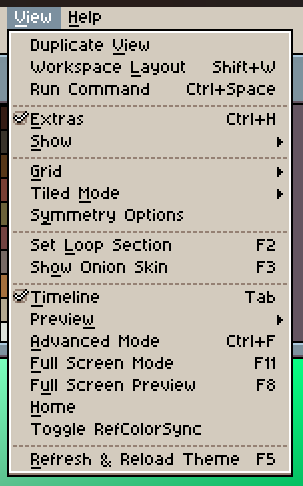
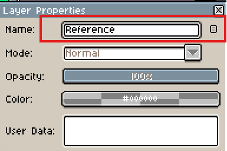
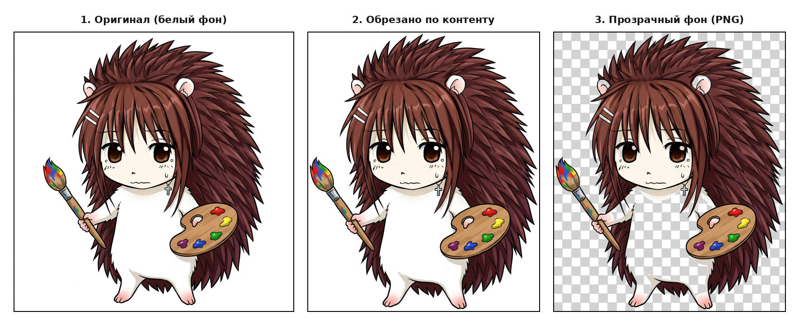
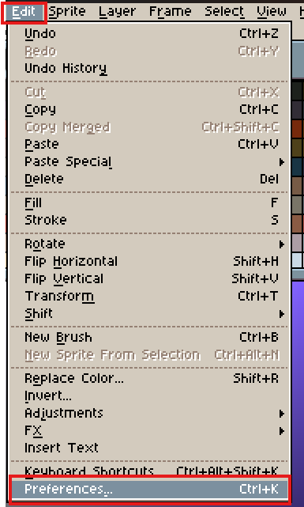
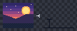
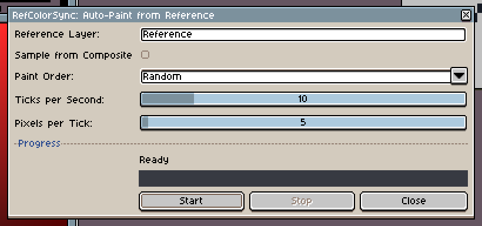

<div align="center">


# 🎨 RefColorSync

### Синхронизация цвета под курсором + постепенная Auto-Paint-закраска из референса для Aseprite

<p>
<a href="https://www.aseprite.org/"></a>
<a href="LICENSE"></a>
<a href="https://github.com/alalal68-wq/RefColorSync_V2.0/releases/latest"></a>
<a href="#"></a>
</p>

<p>
<a href="https://github.com/alalal68-wq/RefColorSync_V2.0/releases/latest/download/RefColorSync_v2.0.0.zip">

</a>
</p>

**Расширение для Aseprite, которое берёт цвет из референс-слоя прямо под курсором и умеет само,
пиксель за пикселем, дорисовывать пустые области спрайта по образцу — не трогая уже нарисованное вручную.**

[Возможности](#-возможности) •
[Установка](#-установка) •
[Auto-Paint](#️-auto-paint-from-reference) •
[Синхронизация цвета](#-синхронизация-цвета-под-курсором) •
[Настройки](#️-настройки) •
[Производительность](#-производительность) •
[Диагностика](#-диагностика) •
[Разработка](#-тестирование-и-разработка)

</div>

<br>

---

## 📖 О проекте

**RefColorSync** — расширение для Aseprite, созданное для пиксель-артистов, которые рисуют
по референсу. Вместо ручного пипетирования цвета на каждом шаге, плагин следит за курсором
и сам подставляет нужный цвет в палитру foreground. А когда нужно быстро набросать базовую
заливку по образцу — режим **Auto-Paint from Reference** аккуратно, транзакция за транзакцией,
переносит пиксели источника в пустые области целевого слоя, гарантированно не трогая то,
что вы уже нарисовали руками.

Версия **2.0** — это стабильный релиз с двумя независимыми режимами работы, полным покрытием
автотестами в реальном Lua-runtime Aseprite и аккуратной обработкой всех крайних случаев:
закрытие спрайта, удаление слоя, блокировка цели, смена кадра во время закраски и многое другое.

---

## ✨ Возможности

| Возможность | Что делает |
|---|---|
| 🖌️ **Auto-Paint from Reference** | Постепенно переносит непрозрачные пиксели источника в пустые пиксели активного слоя |
| 🛡️ **Сохранение ручной работы** | Перед каждым тиком повторно проверяет цель и никогда не заменяет уже непрозрачный пиксель |
| 🎲 **Raster / Random порядок** | Закрашивает по строкам сверху вниз или в перемешанном случайном порядке |
| ⏱️ **Управляемая скорость** | Отдельно настраиваются тики в секунду и количество пикселей за тик |
| 📊 **Живой прогресс** | Показывает подготовку очереди, ход закраски и точное количество обработанных пикселей |
| 🎯 **Автосэмплинг цвета** | Обновляет foreground color по позиции курсора над референсом в реальном времени |
| 🗂️ **Вложенные слои** | Находит именованный референс внутри групп, поиск рекурсивный |
| 🖼️ **Composite mode** | Берёт итоговый видимый цвет всех слоёв вместо одного референс-слоя |
| 🎨 **RGB / Indexed / Grayscale** | Корректно обрабатывает все три основных цветовых режима Aseprite |
| ↩️ **Честный Undo** | Один `Ctrl+Z` отменяет один тик Auto-Paint, а не отдельный пиксель и не весь запуск |
| 💾 **Сохранение настроек** | Хранит параметры watcher и Auto-Paint отдельно друг от друга в `plugin.preferences` |
| ⚡ **Оптимизация по bounding-box** | Именованный источник сканируется только в границах своего cel, а не всего холста |

---

## 🖼️ Скриншоты

<div align="center">


</div>

<div align="center">

</div>

---

## 📦 Установка

1. Скачайте `RefColorSync.aseprite-extension` из [Releases](../../releases).
2. Дважды кликните файл и подтвердите установку в Aseprite.

   <div align="center">
   
   </div>

3. Перезапустите Aseprite.
4. Команды появятся в **File → Scripts**.

**Альтернативный путь** — через настройки Aseprite:

```text
Edit → Preferences → Extensions → Add Extension
```

<div align="center">


</div>

> 💡 **Обновление с более старой версии:** удалять предыдущую установку не нужно. Пакет
> сохраняет внутреннее имя `refcolorsync`, поэтому Aseprite обновляет то же расширение
> и сохраняет все ваши настройки.

---

## 🖌️ Auto-Paint from Reference

Auto-Paint делает снимок источника в момент старта и постепенно заполняет только
прозрачные пиксели выбранного целевого слоя. Всё, что уже нарисовано вручную,
остаётся нетронутым.

<div align="center">

<br><br>

</div>

### 🚀 Быстрый старт

1. Откройте спрайт и создайте (или импортируйте) слой `Reference`.
2. Выберите **обычный image layer**, в который нужно рисовать, и нужный кадр.
3. Откройте **File → Scripts → RefColorSync: Auto-Paint from Reference...**.
4. Выберите порядок закраски и скорость.
5. Нажмите **Start**.

Во время работы можно свободно переключать активный слой или кадр — операция
продолжит рисовать именно в тот слой и кадр, что были захвачены при старте.
Параметры блокируются до завершения, чтобы интерфейс не обещал изменение скорости
посреди уже запущенной операции.

### ⚙️ Параметры Auto-Paint

| Параметр | По умолчанию | Диапазон / смысл |
|---|:---:|---|
| **Reference Layer** | `Reference` | Имя источника; поиск рекурсивный внутри групп |
| **Sample from Composite** | Выкл. | Снимок всего видимого кадра вместо одного слоя |
| **Paint Order** | `Raster` | `Raster` — по строкам, `Random` — случайный порядок |
| **Ticks per Second** | `30` | 1–60 транзакций в секунду |
| **Pixels per Tick** | `50` | 1–500 пикселей за одну транзакцию |

### 🛡️ Гарантии и Undo

- Источник фиксируется в момент **Start** — последующие изменения референса не влияют на текущий запуск.
- Целевой слой и кадр тоже фиксируются при старте.
- Пиксель записывается **только** если он всё ещё прозрачен непосредственно перед записью.
- Каждый тик — отдельная именованная транзакция Aseprite. Один `Ctrl+Z` отменяет один тик, а не один пиксель и не весь запуск.
- **Stop** сохраняет уже выполненную часть работы. При большой оставшейся очереди появляется подтверждение.
- Закрытие спрайта, удаление слоя/кадра или блокировка цели безопасно останавливают операцию и пишут ошибку в консоль — без падений и повреждения документа.

---

## 🖱️ Синхронизация цвета под курсором

Классический режим watcher работает независимо от Auto-Paint и включается/выключается отдельно.

1. Назовите слой-источник `Reference` (или измените имя в настройках).
2. Выполните **File → Scripts → Toggle RefColorSync** либо откройте **RefColorSync Settings...**.
3. Перемещайте курсор по холсту — foreground color будет обновляться из источника автоматически.

Watcher повторно сэмплирует цвет не только при движении курсора, но и при смене кадра
или изменении содержимого спрайта под неподвижным курсором.

---

## ⚙️ Настройки watcher

| Параметр | По умолчанию | Описание |
|---|:---:|---|
| **Reference Layer Name** | `Reference` | Имя слоя-источника; группы обходятся рекурсивно |
| **Update Frequency** | `25 Hz` | Частота опроса, 15–40 Гц |
| **Ignore Transparent Pixels** | Вкл. | Прозрачный источник не меняет foreground color |
| **Sample from Composite** | Выкл. | Сэмплировать видимый композит кадра вместо одного слоя |

Изменения сохранённых настроек сразу перезапускают активный watcher — перезапуск Aseprite
не требуется. Повреждённые или устаревшие значения preferences автоматически нормализуются
при запуске.

---

## 📊 Производительность

В режиме именованного слоя очередь строится только внутри `cel.bounds`, обрезанного
границами холста. Маленький референс на холсте 1024×1024 не заставляет сканировать весь холст.
Подготовка выполняется короткими порциями через таймер, поэтому окно интерфейса не зависает
даже на больших очередях.

`Sample from Composite`, по своей природе, охватывает весь холст и требует полного снимка
кадра, поэтому на больших документах подготовка занимает больше времени.

| Холст | Границы референса | Кандидатов на закраску | Время подготовки |
|---:|---:|---:|---:|
| 1024×1024 | 16×16 | 256 | ~0.001 с |
| 1024×1024 | 1024×1024 | 1 048 576 | ~2.18 с, порциями по таймеру |

---

## ⚠️ Ограничения

- Цель Auto-Paint должна быть редактируемым обычным image layer с поддержкой прозрачности.
- Group, Tilemap, Background и заблокированные слои не поддерживаются как цель.
- Tilemap не поддерживается как именованный источник: его пиксели — это индексы тайлов, а не цвета.
- Auto-Paint работает только в одном выбранном кадре одного спрайта за запуск.
- Lua API Aseprite не позволяет watcher-у перехватывать каждый пиксель внутри уже начавшегося мазка кистью — цвет обновляется между движениями и изменениями редактора.

---

## 🔧 Диагностика

Если команда не открывается или Auto-Paint неожиданно остановился:

1. Откройте **Help → Developer Tools** или запустите Aseprite из терминала.
2. Повторите проблему.
3. Скопируйте строку, начинающуюся с `RefColorSync Auto-Paint error:` или `RefColorSync watcher error:`.
4. Создайте [Issue](../../issues), приложив ошибку, версию Aseprite, цветовой режим и шаги воспроизведения.

Также стоит проверить:

- имя `Reference` совпадает с настройкой **с учётом регистра**;
- в выбранном кадре у референс-слоя есть cel;
- активная цель не является самим референсом;
- цель не заблокирована и поддерживает прозрачность.

---

## 🧪 Тестирование и разработка

Автоматические тесты выполняются **в настоящем Lua runtime Aseprite**, а не в имитации API,
и запускаются из корня репозитория:

```bash
aseprite --batch --script tests/test_config.lua
aseprite --batch --script tests/test_watcher.lua
aseprite --batch --script tests/test_autopaint.lua
aseprite --batch --script tests/benchmark_autopaint.lua
```

Покрытие включает: значения по умолчанию и нормализацию настроек, регистрацию всех команд,
обновление цвета watcher-ом при движении/смене кадра/изменении содержимого, порядок Raster
и Random, все три цветовых режима, вложенные и отсутствующие референс-слои, сохранение
ручных пикселей, источник Composite, поведение Undo, безопасную остановку при закрытии
спрайта или удалении цели, а также bounding-box оптимизацию на больших холстах.

### 📀 Сборка релизного файла

Добавляйте в архив только runtime-файлы, чтобы старый архив, `.git`, тесты и изображения
не попали внутрь нового пакета.

**macOS / Linux (zip):**

```bash
rm -f RefColorSync.aseprite-extension
zip -r RefColorSync.aseprite-extension package.json main.lua src
unzip -t RefColorSync.aseprite-extension
```

**Windows PowerShell:**

```powershell
Remove-Item RefColorSync-2.0.0.zip -ErrorAction Ignore
Compress-Archive -Path package.json, main.lua, src -DestinationPath RefColorSync-2.0.0.zip
Move-Item RefColorSync-2.0.0.zip RefColorSync.aseprite-extension -Force
```

---

## 🗂️ Структура проекта

```text
RefColorSync/
├── package.json
├── main.lua
├── src/
│   ├── autopaint.lua        # Логика постепенной закраски по референсу
│   ├── autopaint_ui.lua     # Диалог Auto-Paint и прогресс-бар
│   ├── config.lua           # Хранение и нормализация настроек
│   ├── sampler.lua          # Сэмплинг цвета из слоя / композита
│   ├── ui.lua               # Диалог настроек watcher
│   └── watcher.lua          # Синхронизация цвета под курсором
├── tests/
│   ├── test_autopaint.lua
│   ├── test_config.lua
│   ├── test_watcher.lua
│   ├── ui_smoke.lua
│   └── benchmark_autopaint.lua
├── tools/
│   └── generate_demo.lua
├── screenshots/
└── LICENSE
```

---

## 🤝 Вклад в проект

Issues и Pull Request-ы приветствуются! Перед отправкой PR:

- прогоните автоматические тесты из раздела [Тестирование и разработка](#-тестирование-и-разработка);
- по возможности приложите скриншот или GIF, если меняется интерфейс;
- опишите цветовой режим и версию Aseprite, на которых проверяли изменения.

---

## 📄 Лицензия

Проект распространяется по лицензии [MIT](LICENSE).

<div align="center">

Сделано с ❤️ для пиксель-артистов, рисующих по референсу.

</div>
